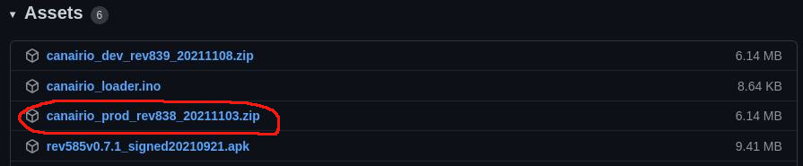

[](https://github.com/kike-canaries/canairio_firmware/actions/)  [](https://liberapay.com/CanAirIO) [](https://t.me/canairio)

# CanAirIO firmware


<a href="https://play.google.com/store/apps/details?id=hpsaturn.pollutionreporter" target="_blank"></a>

Citizen science project with mobile and fixed sensors for measuring air quality (PM 2.5 or CO2) using low-cost sensors and smartphones. Built with a `ESP32` module board interfaced with an [CanAirIO Android client app](https://github.com/kike-canaries/canairio_android). 

<table>
	<tr>
		<td>
			Don't forget to star ⭐ this repository
		</td>
	</tr>
</table>

## Features

- Super easy [web installer](https://canair.io/installer), via Chrome or Edge
- Mobile station (via Bluetooth LE for tag GPS variables)
- Fixed station, (using only your WiFi)
- Fast WiFi credentials provisioning via Bluetooth
- Automatic firmware OTA updates (stable/testing channels)
- Share mobile tracks via [mobile.canair.io](https://mobile.canair.io) or [CanAirIO app](https://github.com/kike-canaries/canairio_android)
- [Home Assistant](https://www.home-assistant.io/) integration, discovery and multisensor support
- Share your fixed station quickly via [Anaire Cloud](https://portal.anaire.org/d/detail/detalle?orgId=1&var-uid=U33TTGOTDA3D46&var-name=&refresh=1m)
- Separated [sensors layer](https://github.com/kike-canaries/canairio_sensorlib#readme) for improve support of new sensors
- Multiple boards and sensors support with only one firmware

## Boards supported

The [last release](https://github.com/kike-canaries/canairio_firmware/releases) of CanAirIO Device supports the next boards:

| Firmware Name | Boards supported |   Display  |  Guide and schematics  |
| ------------- |:-------------:| :-------------:| :----------------------:|
| **TTGO_TDISPLAY**     | TTGO T-Display | eTFT | [CanAirIO Bike](https://canair.io/docs/canairio_bike.html) |
| **TTGO_T7**     | TTGO T7, D1Mini, ** | OLED 64x48 | [CanAirIO v2.1](https://www.hackster.io/canairio/build-a-low-cost-air-quality-sensor-with-canairio-bbf647) [CanAirIO IKEA](https://canair.io/docs/canairio_ikea.html) |
| **M5STICKCPLUS** | M5StickC Plus | eTFT | [CanAirIO in M5StickC Plus](https://www.youtube.com/watch?v=TdX1AZ4PzBA) |
| **M5ATOM** | M5Atom Lite | OLED I2C | [M5Atom Lite sample](https://canair.io/docs/canairio_m5stack.html#m5atom-lite)|
| **ESP32DevKit** | ESP32DevKit, NodeMCU V3, ** | OLED 128x64 | [HacksterIO](https://www.hackster.io/canairio/build-low-cost-air-quality-sensor-canairio-without-soldering-d87494) |
| **TTGO_TQ** | TTGO TQ | Builtin OLED  | [TTGO_TQ board](https://de.aliexpress.com/item/10000291636371.html) |
| **WEMOSOLED** | WemosOLED and similar boards | OLED 128x64 | [ESP32 OLED board](https://de.aliexpress.com/item/33047481007.html) |
| **HELTEC** |  ESP32 Heltec board |  OLED 128x64 | | 


** is possible that the **current firmware supports more boards** and sensors. Also you can choose the sensor brand or type on the CanAirIO Android app.


# Installation alternatives

We have different alternatives for load the current firmware. In order of complexity they are:

## Via CanAirIO Web Installer (RECOMMENDED)

If you already have a ESP32 board, you can test our CanAirIO firmware on one click, with our web installer:  

[](https://canair.io/installer.html)

## Via CanAirIO loader

You will able to install the last version of CanAirIO firmware with internet updates via a simple Arduino sketch that it will doing all for you, you only need to use the official [Arduino IDE](https://www.arduino.cc/en/software) or [Arduino Droid app for Android](https://play.google.com/store/apps/details?id=name.antonsmirnov.android.arduinodroid2&hl=en&gl=US) for load this [simple sketch](https://github.com/hpsaturn/esp32-canairio-loader/blob/master/canairio_loader/canairio_loader.ino). Please follow the instructions [here](https://github.com/hpsaturn/esp32-canairio-loader) or follow the next [YouTube video guide](https://youtu.be/FjfGdnTk-rc) for Android OTG installation alternative.

## Via binaries 

You can download the last firmware version in [releases](https://github.com/kike-canaries/esp32-hpma115s0/releases) section. Download the last **production** release from `assets` section, for example: 



please uncompress the zip file and connect your CanAirIO device to your USB and execute the next command for upload the firmware to your model board, for example to a TTGO_T7 board you should run the next commands:

### Linux and MacOSx

``` bash
unzip canairio_rev414_20190829.zip
cd canairio_installer
./install.sh canairio_TTGO_T7_rev839.bin
```
**Note**: you need python2 or python3 with pyserial in your system.

### Windows

Please read the [Espressif Uploader](https://canair.io/docs/firmware_upload.html#espressif-uploader) section in the main documentation for details to load the firmware via the oficial **Espressif Download Tool** in Windows.

### OTA WAN updates

CanAirIO has two channels for remote OTA updates of your device, production channel and development channel. With that you don't need again install the firmware for any update, all here is automatic and you only need have WiFi enable on your device for receive this firmware updates.

If you want the last testing updates, please choose in the previous step the development firmware (zip file with **dev** name), and upload it to your board.

### OTA LAN alternative

After USB binary installation, you will able to send OTA updates to any board supported, like this:

``` bash
./install.sh ota canairio_d1mini_rev414_20190829.bin
```

Also you can specify the IP address:

```bash
./install.sh ota canairio_xxx.bin 192.168.1.10
```

More details and options of `CanAirIO Installer` [here](https://github.com/kike-canaries/canairio_firmware/tree/master/releases/installer/canairio_installer#readme)


## Via PlatformIO (Compiling on Linux, Mac or Windows)

Please install first [PlatformIO](http://platformio.org/) open source ecosystem for IoT development compatible with **Arduino** IDE and its command line tools (Windows, MacOs and Linux). Also, you may need to install [git](http://git-scm.com/) in your system.

For the **default** board `TTGO_TDISPLAY` (CanAirIO Bike), clone and upload firmware via USB cable:

``` bash
git clone https://github.com/kike-canaries/canairio_firmware
cd canairio_firmware
pio run --target upload
```

For a specific firmware for example for a TTGO-T7 board, only change the last line for:

``` bash
pio run -e TTGO_T7 --target upload
```

## Via Docker

First build the Docker image using the following command line:

```bash
docker build -t canairio_pio:master .
```

This build a basic compiler image with all PlatformIO stuff. For build the project you only needs now run:

```bash
./docker_build run
```

### Building Installer

You can build `CanAirIO Installer` zip package with all binaries of all board flavors running the next command:

``` bash
./build all && ./build installer
```

The directory output is in: `releases/installer`  
Also the binaries flavors directory: `releases/binaries/`

More details and options of `CanAirIO Installer` [here](https://github.com/kike-canaries/canairio_firmware/tree/master/releases/installer/canairio_installer#readme)


### Troubleshooting

If you have some issues with Bluetooth library internals, or libraries issues, please upgrade all frameworks and tools on PlatformIO:

``` bash
pio update
sudo pio upgrade
pio lib update
```

And maybe clean all caches:

``` bash
pio run -t clean
rm -rf .pio
```

If you want clear all ESP32 preferences and flash variables in your board, please execute before:

```bash
./install.sh erase /dev/ttyUSB0
```

# Supporting the project

If you want to contribute to the code or documentation, consider posting a bug report, feature request or a pull request.

When creating a pull request, we recommend that you do the following:

- Clone the repository
- Create a new branch for your fix or feature. For example, git checkout -b fix/my-fix or git checkout -b feat/my-feature.
- Run to any clang formatter if it is a code, for example using the `vscode` formatter. We are using Google style. More info [here](https://clang.llvm.org/docs/ClangFormatStyleOptions.html)
- Document the PR description or code will be great
- Target your pull request to be merged with `devel` branch

Also you can consider make a donation, be a patron or buy a device:  

- Via **Ethereum**:
- 0x1779cD3b85b6D8Cf1A5886B2CF5C53a0E072C108
- Be a patron: [Github Sponsors](https://github.com/sponsors/hpsaturn), [LiberaPay](https://liberapay.com/CanAirIO)
- **Buy a device**: [CanAirIO Bike in Tindie](https://www.tindie.com/products/hpsaturn/canairio-bike/)
- Inviting us **a coffee**: [buymeacoffee](https://www.buymeacoffee.com/hpsaturn), [Sponsors](https://github.com/sponsors/hpsaturn?frequency=one-time) 

<a href="https://raw.githubusercontent.com/kike-canaries/canairio_firmware/master/images/ethereum_donation_address.png" target="_blank"></a>

**NOTE:**  Supporting our Citizen Science Initiative many people be able to fight for air quality rights in many countries with this kind of problems. More info in [CanAir.IO](https://canair.io)

For our supporters, patrons or donors, we will send the preview versions of our coming versions:

## CanAirIO CO2 and CanAirIO Mini box


# CanAirIO device HOWTO guide

We have some build guides with different alternatives, please visit our [CanAirIO documentation](https://canair.io/docs).

<a href="https://canair.io/docs" target="_blank"></a>

## Building Guide

<a href="https://youtu.be/V2eO1UN5u7Y" target="_blank" style="padding-left: 20px" ></a>

## Soldering Guide (some improvements)

<a href="https://youtu.be/Oarq0K0Sz3c" target="_blank" style="padding-left: 20px" ></a>

## Box STL files

** ***************** **
** W A R N N I N G **

The full updated and last versions for all box versions, are in the [official repository](https://github.com/kike-canaries/canairio_firmware/tree/master/box) because it is more easy for handling the versions than Thingiverse. This page it is only a guide.

** ***************** **

# TODO

- [X] Enable/Disable APIs from App
- [X] Locatitation settings via Bluetooth
- [X] Sensors manager is now a library ([CanAirIO Sensorlib](https://github.com/kike-canaries/canairio_sensorlib#canairio-air-quality-sensors-library))
- [X] Auto detection of PM sensors (see sensorlib doc)
- [x] CO2 sensors in chart
- [X] OTA updates (LAN and WAN) (dev/prod, see releases for details) 
- [x] Multiple variables in chart (C02,PM2.5,Hum,Temp,etc)
- [x] Map of each recorded track in details
- [x] InfluxDB schema (by geohashes)
- [x] New pax counter variable (People around the device)
- [x] WiFi SSIDs scanner for have a choose list of it in the app
- [x] Pax counter disable/enable
- [x] Home Assistant integration (with zero-config)
- [x] Anaire cloud integration (Automatic time series of your station)
- [ ] Sensor community alternativa for fixed stations
- [ ] Anonymous authentication

