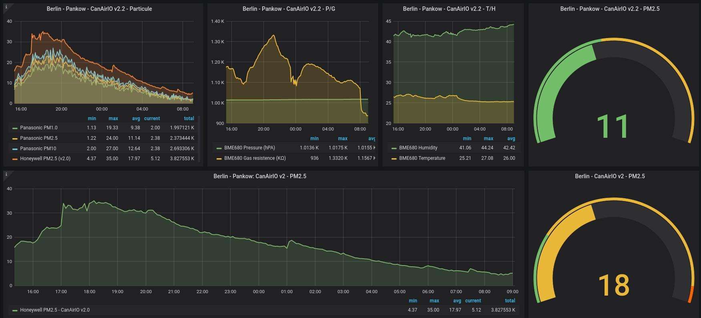
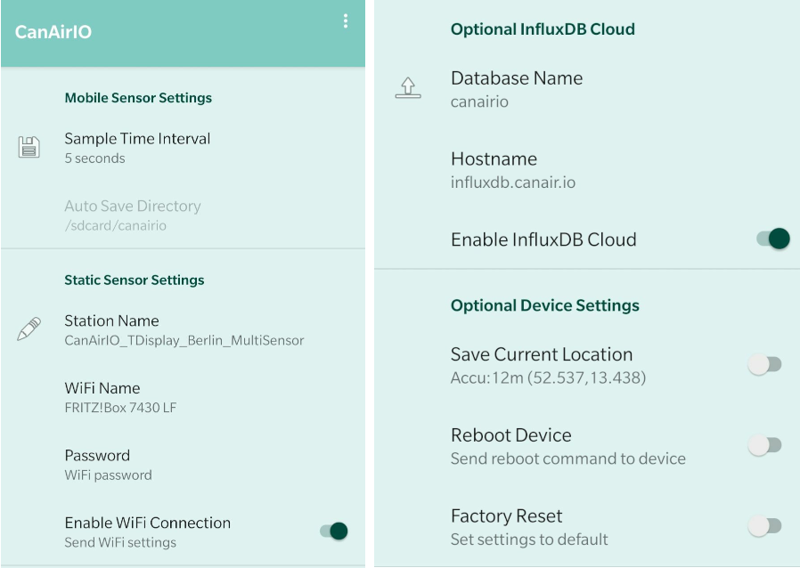

[](https://travis-ci.com/kike-canaries/esp32-hpma115s0) [](https://liberapay.com/CanAirIO) 
 
# CanAirIO firmware

<a href="https://github.com/kike-canaries/esp32-hpma115s0/blob/master/images/collage.jpg" target="_blank"></a>

<a href="https://play.google.com/store/apps/details?id=hpsaturn.pollutionreporter" target="_blank"></a>

Citizen science project with mobile and fixed sensors for measuring air quality (PM 2.5) using low-cost sensors and smartphones. Built with a `ESP32` module board and a dust sensor, interfaced with an [CanAirIO Android client app](https://github.com/kike-canaries/android-hpma115s0). The current firmware supports multiple boards and sensors, please review the **DIY guides** in our [wiki](https://github.com/kike-canaries/esp32-hpma115s0/wiki) 

## Installation

### Linux and MacOSx

You can download the last firmware version in [releases](https://github.com/kike-canaries/esp32-hpma115s0/releases) section. Download the last release from `assets` section in releases and please uncompress zip file.

#### USB alternative

Connect your CanAirIO device to your USB and execute the next command for your model board*, like this:

``` bash
unzip canairio_rev414_20190829.zip
cd canairio_installer
./install.sh canairio_TTGO_T7_rev605_20200925.bin
```

**Note**: you need python2 or python3 with pyserial in your system.

#### Boards

**TTGO_T7** firmware for CanAirIO v2.1 ([TTGO_T7 board with Panasonic sensor](https://www.hackster.io/canairio/build-a-low-cost-air-quality-sensor-with-canairio-bbf647))  
**TTGO_T7_LEGACY** firmware for CanAirIO v2.0 ([TTGO_T7 or D1Mini board with Honeywell sensor](https://github.com/kike-canaries/esp32-hpma115s0/wiki/Old-Guide-(EN)))  
**TTGO_TQ** firmware for [TTGO_TQ board](https://de.aliexpress.com/item/10000291636371.html) and Honeywell.  
**WEMOSOLED** firmware for [ESP32 OLED board](https://de.aliexpress.com/item/33047481007.html) and Honeywell

Is possible that the current firmware supports more boards and sensors, for example the `Honeywell` variant supports **Plantower** sensors, and in theory we have support  for all `lolin32` variants and TTGO variants. Please see [compiling section](#optional-compiling-and-installing).


**Tip**: if you want clear all preferences and flash variables, please execute before:

``` bash
./esptool.py --port /dev/ttyUSB0 erase_flash
```

#### OTA alternative

After that you will able to send OTA updates to any board supported, like this:

``` bash
./install.sh ota canairio_d1mini_rev414_20190829.bin
```

### Windows

Please read procedure on `firmware` section on [HacksterIO Guide](https://www.hackster.io/114723/canairio-red-ciudadana-para-monitoreo-de-calidad-del-aire-96f79a#toc-firmware-y-software-3) for details for load firmware via oficial **Espressif Download Tool** in Windows

## [Optional] Compiling and installing

Please install first [PlatformIO](http://platformio.org/) open source ecosystem for IoT development compatible with **Arduino** IDE and its command line tools (Windows, MacOs and Linux). Also, you may need to install [git](http://git-scm.com/) in your system.

For **default** board `TTGO_T7`, clone and upload firmware via USB cable:

``` bash
git clone https://github.com/kike-canaries/esp32-hpma115s0.git
cd esp32-hpma115s0
pio run -e TTGO_T7 --target upload
```

After that, it able for sending updates via OTA protocol using Wifi in your LAN, is more fastest than USB and you can disconnect your board, but `you need first save Wifi credentials` via Android CanAirIO app [see below](#settings).

For **OTA updates** you only run

``` bash
pio run -e TTGO_T7_OTA --target upload
```

**Optional** for other board, please select the right environment for example for `wemos` board:

``` bash
pio run -e WEMOSOLED --target upload
```

Also you can change in `platformio.ini` the next parameters:

-D CORE_DEBUG_LEVEL=0, set to 3 for get more verbose log.  
-D EMOTICONS, comment or uncomment for enable emoticons.  
-D PANASONIC, comment or choose your sensor for each section.  
upload_port, in OTA section, set to CanAirIO device IP address.


### Building Installer

You can build `CanAirIO Installer` zip package with all binaries of all board flavors running the next command:

``` bash
./build all && ./build installer
```

The directory output is in: `releases/installer`  
Also the binaries flavors directory: `releases/binaries/`

### Troubleshooting

If you have some issues with Bluetooth library internals, or libraries issues, please upgrade all frameworks and tools on PlatformIO:

``` bash
pio update
sudo pio upgrade
pio run -t clean
rm -rf .pio
pio lib update
pio run --target upload
```

# Android CanAirIO App

For now you need any Android device with Bluetooth 4 or above. You can download the CanAirIO app from [GooglePlay](https://play.google.com/store/apps/details?id=hpsaturn.pollutionreporter), keep in mind that it is in continuos development then please any feedback, report errors, or any thing please let us knowed it via our [contact form](http://canair.io/#three) or on our [Telegram chat](https://t.me/canairio)

You have **two configuration options or modes** of your CanAirIO device from the app:

## Mobile Station Mode

For record tracks on your device (Sdcard) or publish it to the cloud (share), please follow the next steps:

### Connection to device

<a href="https://github.com/kike-canaries/esp32-hpma115s0/blob/master/images/device_connection.jpg" target="_blank"></a>

### Recording track and share

<a href="https://github.com/kike-canaries/esp32-hpma115s0/blob/master/images/app_track_record.jpg" target="_blank"></a>

**NOTE**: Also all recorded tracks will be saved in the `/sdcard/canairio/` directory on `json` format.

---

## Static Station Mode



Also, you can connect your CanAirIO device to the WiFi and leave this like a fixed station. In this mode you only need the Android app only for initial settings, after that the device could be publish data without the phone. For this you need configure it in `settings` section:

### Settings




- **Station Name**: for example: `PM25_Berlin_Pankow`
- **Wifi Name and Password**:
  - Your Wifi network credentials.
  - Save the credentials with the switch.
- **InfluxDB Cloud**: add the next values,
  - Database name: `canairio`  
  - Hostname: `influxdb.canair.io`
  - Save the settings with the switch.

The data will be configured and showed in [CanAirIO Grafana Server](https://bit.ly/3bLpz0H).

### Settings Tools

- Reboot device: Only for restart your CanAirIO device
- Factory Reset: For set all settings to default on your CanAirIO device

## TODO

- [X] Enable/Disable APIs from App (on testing)
- [X] Locatitation settings via Bluetooth (on testing)
- [X] OTA updates ready (LAN)
- [ ] OTA updates (WAN)
- [ ] Migrate `loop` to multithread RTOS implementation
- [ ] Dinamic Humidity and Temperature visualization on Display

---

## CanAirIO device HOWTO guide

You can build a device to measure air quality by using a PM2.5 or similar sensor, for then publish it to CanAirio cloud or a personal server using [CanAirIO App](https://play.google.com/store/apps/details?id=hpsaturn.pollutionreporter), more info here:

[CanAirIO guide wiki](https://github.com/kike-canaries/esp32-hpma115s0/wiki)  


<a href="https://raw.githubusercontent.com/kike-canaries/esp32-hpma115s0/master/images/collage_v2.jpg" target="_blank"></a>
